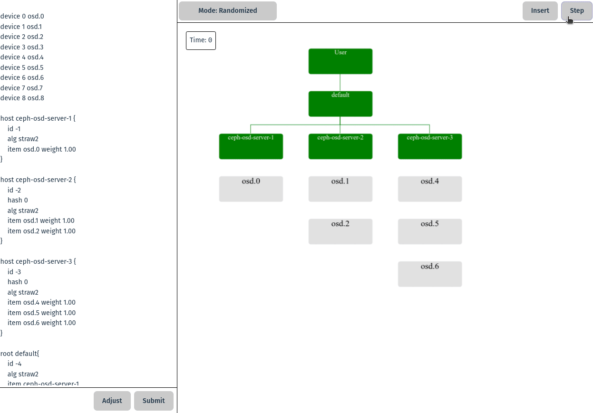

# Ceph visualization



## Launching an App

### Backend

**Python 3.11+ is required**

```sh
cd ./backend
python -m venv .venv 
source .venv/bin/activate
pip install -r requirements.txt
python main.py
```

### Frontend

```sh
npm i vite
npm run dev
```
